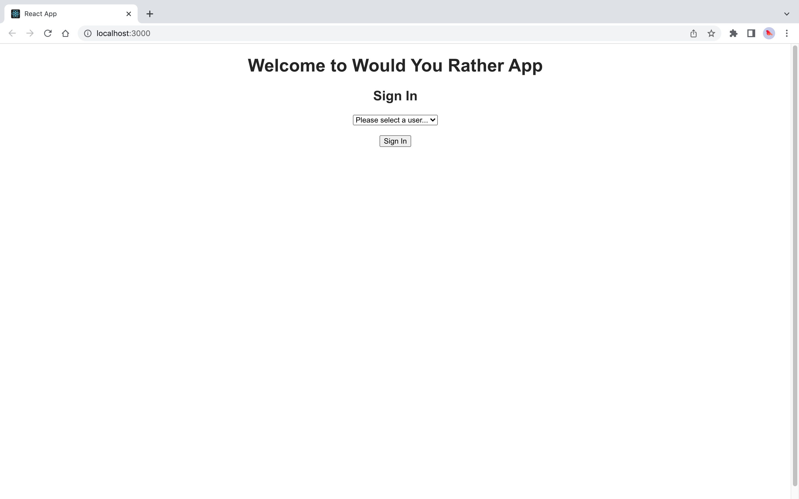
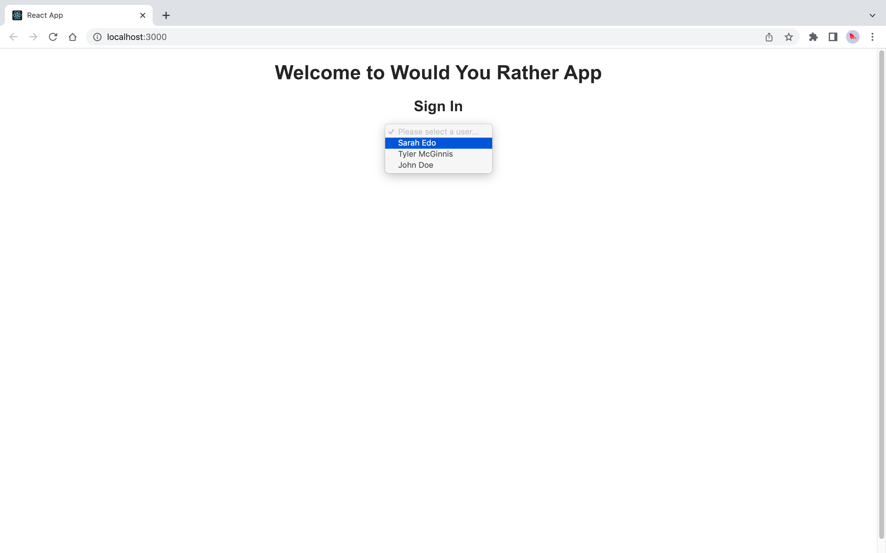
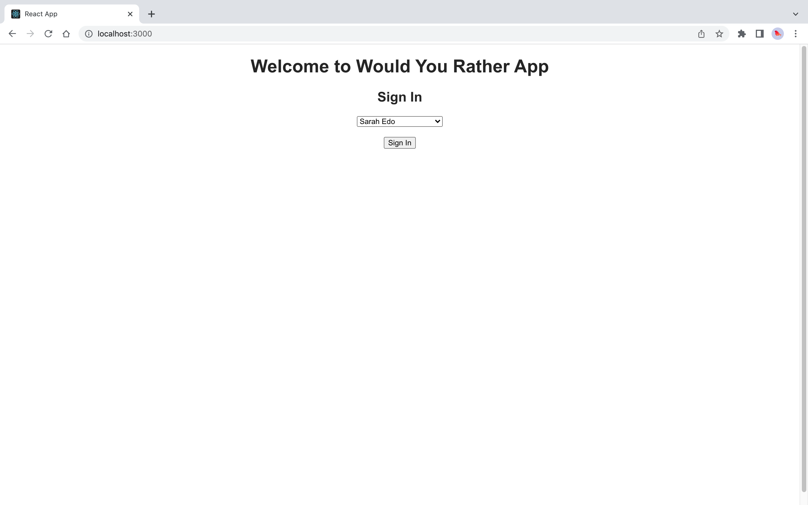
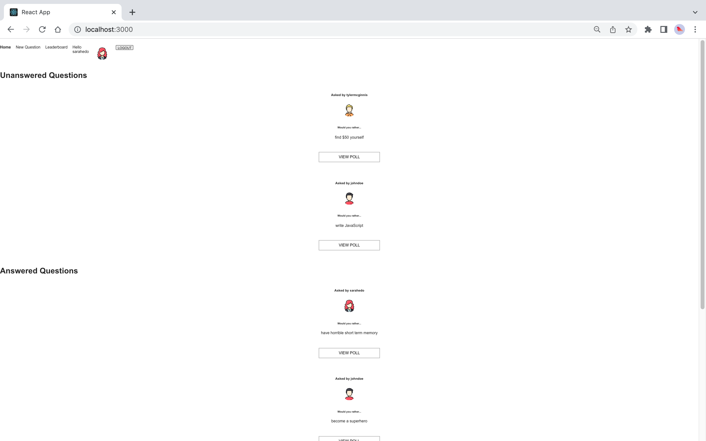
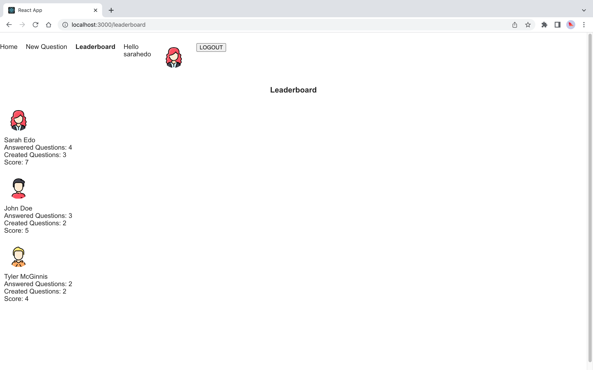
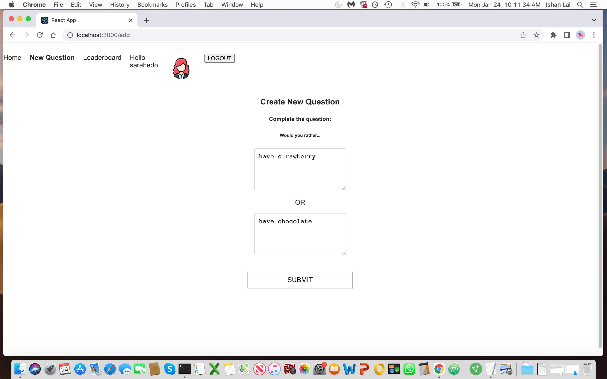
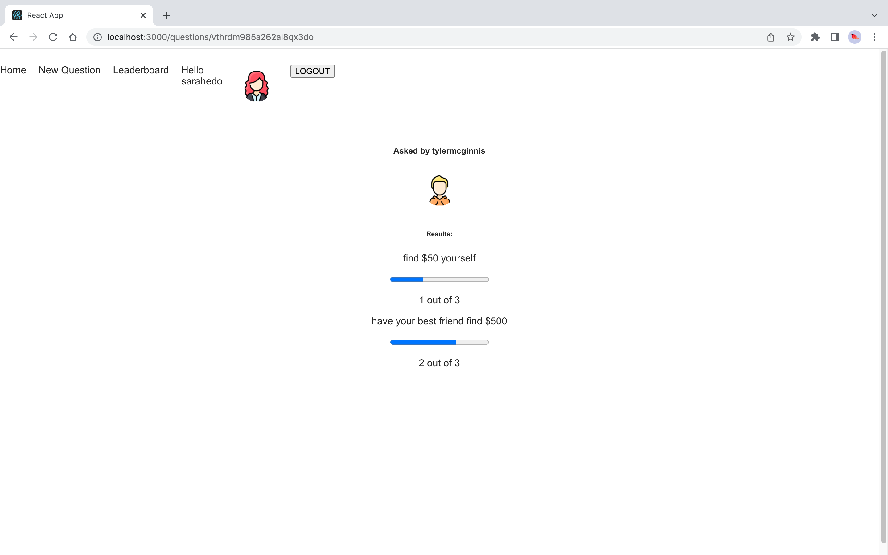
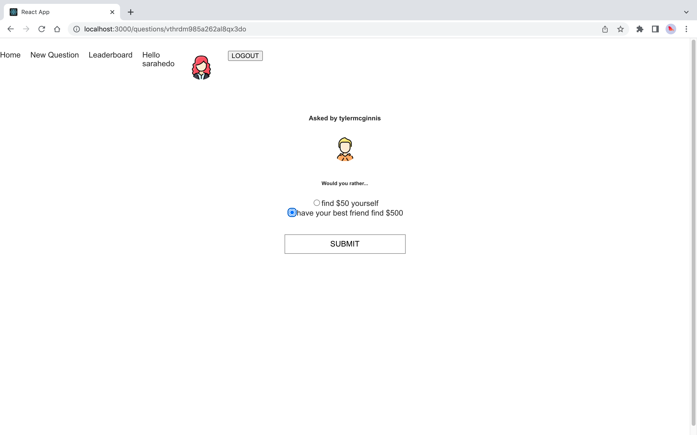

# Would you Rather App

Built a Would You Rather? app as part of Udacity's React Nanodegree program. Its a web app that lets a user play the “Would You Rather?” game. The game goes like this: A user is asked a question in the form: “Would you rather [option A] or [option B] ?”. Answering "neither" or "both" is against the rules. Users will be able to answer questions, see which questions they haven’t answered, see how other people have voted, post questions, and see the ranking of users on the leaderboard.

App Demo: [Would you Rather Demo](https://www.youtube.com/watch?v=xfmSkLAL__Q&t=1s).

## To run the project

* Clone the repo to your local directory.
* Install all project dependencies with `npm install`
* Start the development server with `npm start`

# Screenshots

